# WorkoutTracker Screenshots

This gallery showcases the current iPhone app screenshots stored in this folder.

The previews below use generated thumbnails for faster GitHub loading. Click any image to open the full-size screenshot.

## App Gallery

<table>
  <tr>
    <td align="center">
      <a href="./wt-1.png">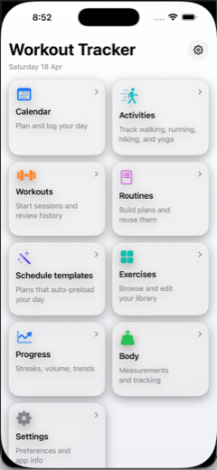</a> 
      Screenshot 1
    </td>
    <td align="center">
      <a href="./wt-2.png">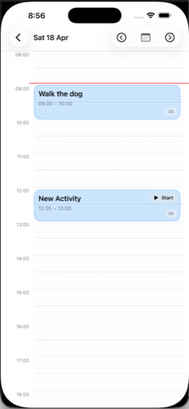</a> 
      Screenshot 2
    </td>
  </tr>
  <tr>
    <td align="center">
      <a href="./wt-3.png">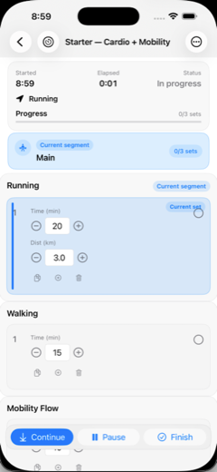</a> 
      Screenshot 3
    </td>
    <td align="center">
      <a href="./wt-4.png">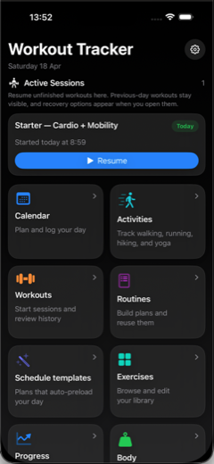</a> 
      Screenshot 4
    </td>
  </tr>
  <tr>
    <td align="center">
      <a href="./wt-5.png">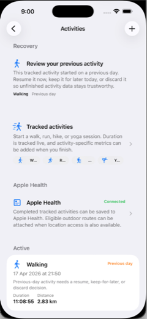</a> 
      Screenshot 5
    </td>
    <td align="center">
      <a href="./wt-6.png">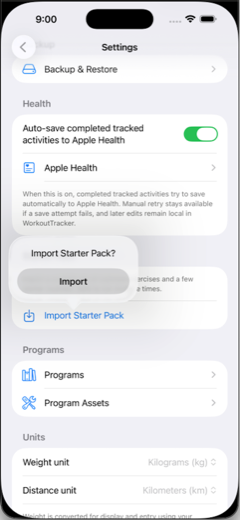</a> 
      Screenshot 6
    </td>
  </tr>
  <tr>
    <td align="center">
      <a href="./wt-7.png">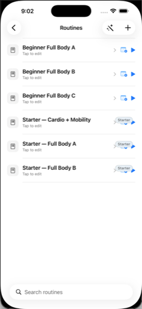</a> 
      Screenshot 7
    </td>
    <td align="center">
      <a href="./wt-8.png">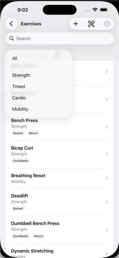</a> 
      Screenshot 8
    </td>
  </tr>
  <tr>
    <td align="center">
      <a href="./wt-9.png">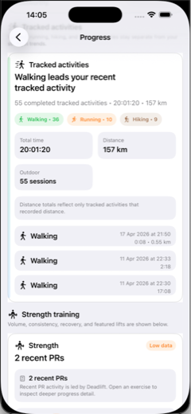</a> 
      Screenshot 9
    </td>
    <td align="center">
      <a href="./wt-10.png">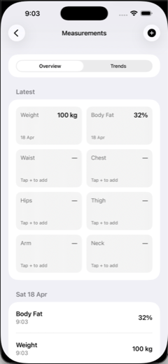</a> 
      Screenshot 10
    </td>
  </tr>
  <tr>
    <td align="center">
      <a href="./wt-11.png">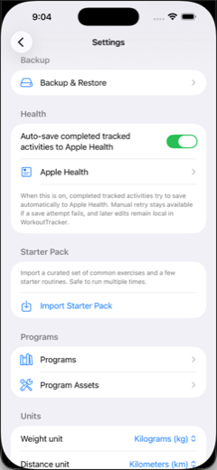</a> 
      Screenshot 11
    </td>
    <td></td>
  </tr>
</table>
